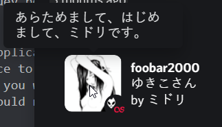

## listening-to
a program that displays your current status on last.fm to the world on discord


### installation
to install from source:
1. clone and cd into this github repository with
    ```bash
    git clone https://github.com/juup1ter/listening-to/ && cd listening-to
    ```
    or, download the tarball and extract it
1. go to the [discord dev portal](https://discord.com/developers/) and create a new application, you will replace client_id in config.json with your application id
1a. name this application whatever you want your status to look like, for example: if you want it to display "Playing music", you would name the application "music".
3. find your discord user token, google how to do it. you will replace discord_token in config.json with your token

    > be warned as this is in the grey area of discord tos, i am not liable if any action is taken on your account as a result of this program. 
    > DO NOT SHARE YOUR TOKEN ANYWHERE AND DO NOT COMMIT IT TO GITHUB    

3. go to the [last.fm api page](https://www.last.fm/api) and register for an account. you will replace lastfm_api_key in config.json with your api key after registering.
4. finally, replace lastfm_name with your last.fm name in config.json
5. install any pip packages that you are missing with
    ```bash
    python3 -m pip install -r requirements.txt
    ```
to install a compiled binary for windows only, just click on the releases tab next to the source code.

### usage
to run, simply execute
```
python3 server.py
```
in whatever directory you cloned into
> discord takes a while to cache the album art so you might have to wait a little before the album art will show up

or, execute the binary you downloaded

if you see "starting listening-to", and it starts to display "caching" messages; you've successfully ran the program. your status should be changed on discord.

if you have any problems caching stuff (status will not change on discord but last.fm reports a change), then try editing replace.json with some of the characters that may be of issue.
this shouldn't be a problem, but i'll leave it here just in case.

### credits
base by null, null#3330

expanded by jupiter, jupiter#0413

thanks to qwertyquerty for [pypresence](https://github.com/qwertyquerty/pypresence)
